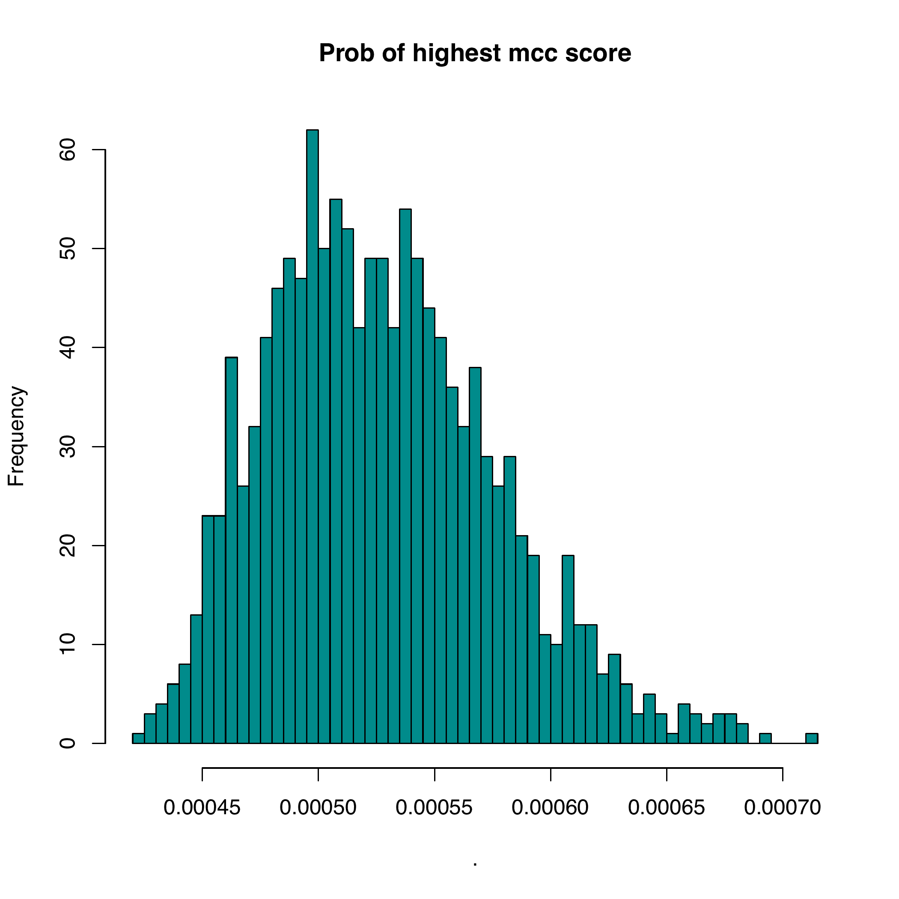
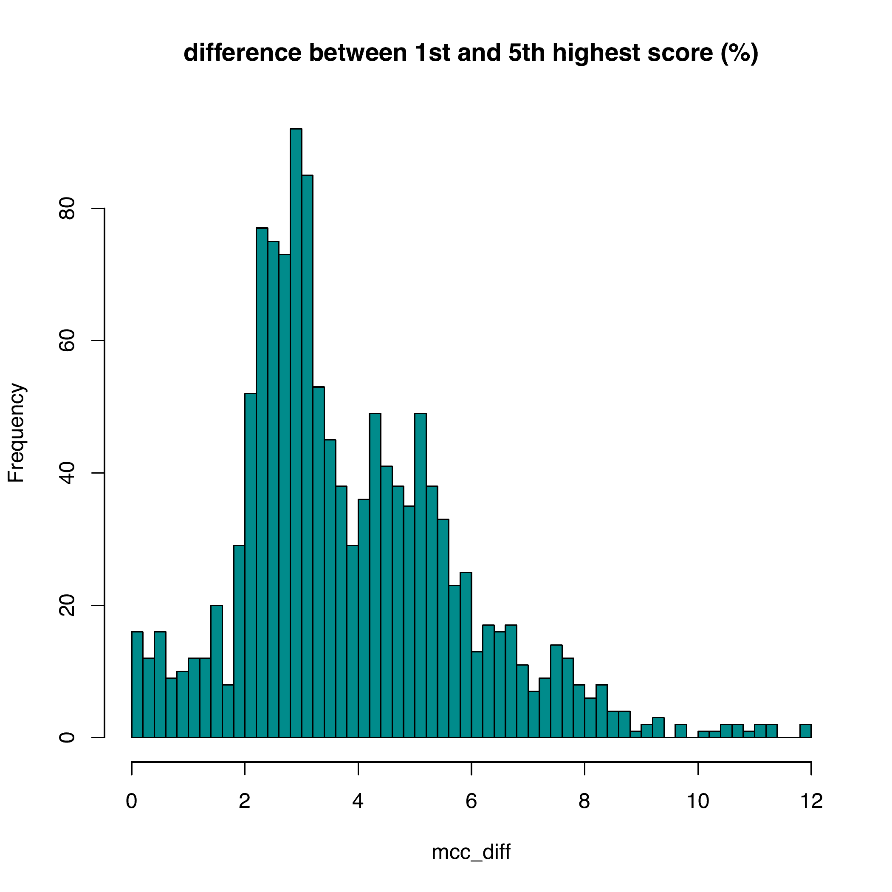
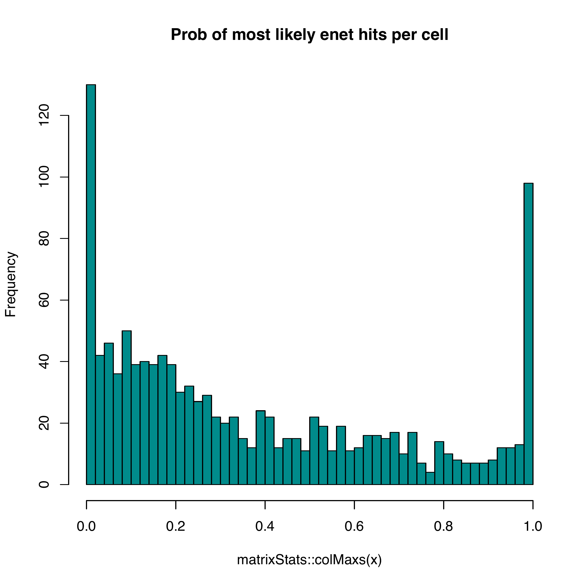
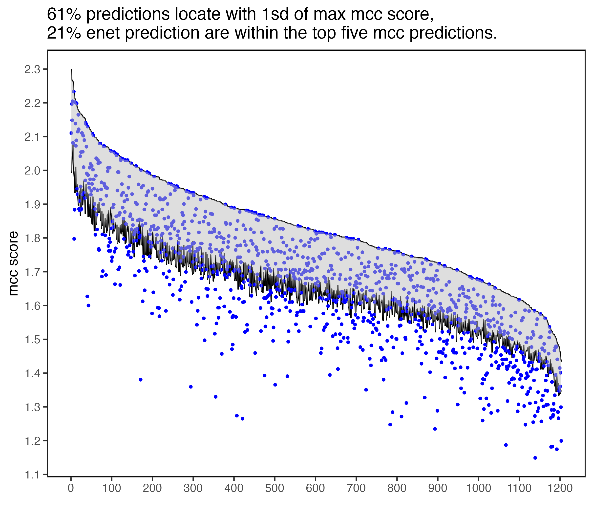
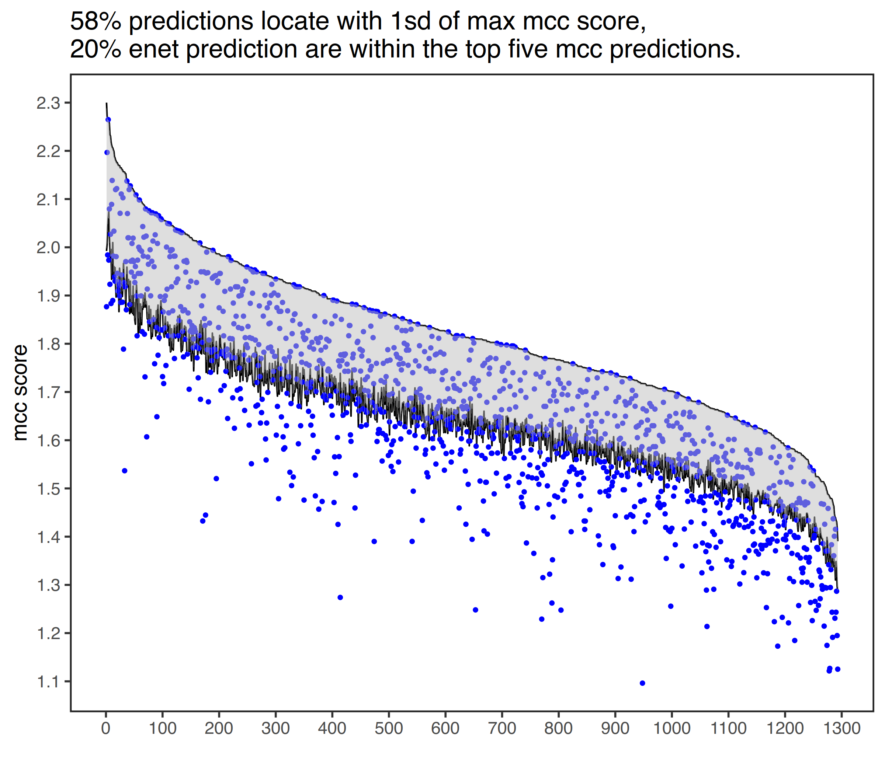

# Introduction
## Principles
`rsenet` aims to resolve the spatial location of single cells (profiled in scRNA-seq experiments) with previous known information (bins). Based on the same genes detected in both query and reference datasets, `rsenet` perform regularized regression (Elastic Net/ Lasso) with the expression from single cell experiments as responsible variables, and values from bins as predictor variables. The coefficients of bins considered as the assignment probabilities.Additionally, an adaptive technique that uses ridge regression to find the penalties is employed to address the problem of strongly correlated bins. Consensus assignment are obtained via running the analysis multiple times.

Generally rsenet sloves the following equations, while c1, c2, ..., are cells to be aligned, and B1, ..B1 are known bins. The coefficients b1, ..., are foced to be non-negative. 
$$E_{c1g1} = B0 + b_{1} * B_{1} + b_{2} * B_{2} + b_{3} * B_{3} +  ...$$
$$E_{c1g2} = B0 + b_{1} * B_{1} + b_{2} * B_{2} + b_{3} * B_{3} +  ...$$
$$...$$

## CCA
We also employed the canonical correlation analysis to pre-select candidate bins. Basically we aims to find the k nearest bins for each cell in correlated space, which the euclidean distance could be used as penalties in the adaptive process. In two matics, features by bins, and features by cells are embedded into low dimension space by canonical correlation analysis. The canonical covariates are latent variables which could be thought of cell clusters in this study, and canonical vectors could be considered as loading of each cell of latent cell cluster.

The original CCA maximize:
$$W_{1}^{T}X_{1}^{T}X_{2}W_{2}$$

subset to:
$$W_{1}^{T}X_{1}^{T}X_{1}W_{1} = 1$$
$$W_{2}^{T}X_{2}^{T}X_{2}W_{2} = 1$$

There are no unique solutions when rank of columns is larger than rank of rows in $X_{1/2}$. Thus a diagonal covariance matrix is assumed (referred as diagonal CCA):
$$X_{1}^{T}X_{1} = 1$$
$$X_{2}^{T}X_{2} = 1$$

and apparently:
$$W_{1}^{T}W_{1} = 1$$
$$W_{2}^{T}W_{2} = 1$$

It turns out the solutions are simply the eigenvectors of $X_{1}^{T}X_{2}$. See description of CCA in Seurat[1] and Siganc[2] for details.


# Analysis
First install the pacakge form github.
```r
remotes::install_github("ccshao/rsenet")
```

It is highly recommeded to install parallelization backends.
```r
install.packages("doRNG")
install.packages("doFuture")
```

A subset of scRNA-seq and reference bins data from fly embyro[3]  are included in the package. Please refer to the publication for more information, including steps of normalization. The inference could be run easily as the following codes.
```r
library(doFuture)
library(progressr)

registerDoFuture()
plan(multicore, workers = 4)

#- Reference and scRNA-seq data, respectively.
data(example_bin)
data(example_expr)

#- Returns bins by cells matrix.
res <- enet(example_bin, example_expr)

#- With progress bar.
with_progress(res <- enet(example_bin, example_expr))
```

# Comparison
Nikos Karaiskos et al. [1] developed an method, `DistMap`, to assign cells to bins. As shown bellow, `DistMap` generate a continuous mcc score (correlation between cells and bins) which have little difference among bins, thus could not give an accurate estimation of cells locations.



`rsent` is able to sparsely allocate cells to bins because of regularized regressions. In addtions, cells that are unlikely to locate in the same spatial regions are identified. The results from `rsent` are comparable with `DistMap`, with about 60% of bins predicted are among the top bins within 1sd.



`enet_cca` runs much faster and give similar results.


# Reference
[1] Stuart, T., Butler, A., Hoffman, P., Hafemeister, C., Papalexi, E., Mauck, W.M., Hao, Y., Stoeckius, M., Smibert, P., and Satija, R. (2019). Comprehensive Integration of Single-Cell Data. Cell 177, 1888-1902.e21. https://doi.org/10.1016/j.cell.2019.05.031.
[2] Butler, A., Hoffman, P., Smibert, P., Papalexi, E., and Satija, R. (2018). Integrating single-cell transcriptomic data across different conditions, technologies, and species. Nature Biotechnology https://doi.org/10.1038/nbt.4096.
[3] Karaiskos N, Wahle P, Alles J, Boltengagen A, Ayoub S, Kipar C, et al. The Drosophila embryo at single-cell transcriptome resolution. Science. 2017;358:194–9.
